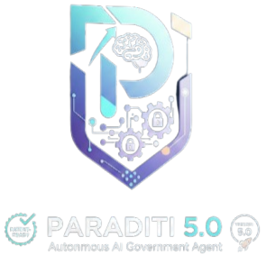

# P Λ R Λ D I T I (परादिति) - AI-Native Economic Mobility Platform

<p align="center">
  
</p>

**Founder:** PARAS AGRAWAL  
**Status:** Patent-Ready | **Version:** 5.4 (Stable)  
**Track:** AI-Powered Social Impact (Economic Mobility)

---

## 🚀 The Vision: Beyond Portals, Towards Intelligent Mobility

**P Λ R Λ D I T I** is Bharat's first **AI-Native Economic Mobility Platform**. Modern welfare systems suffer from a $1.2 Trillion discovery gap. While current government portals act as passive "listing" pages, P Λ R Λ D I T I operates as an **Autonomous Agent** that guarantees benefit discovery, analyzes eligibility friction, and guides citizens from application to credit-worthiness.

### 🏛️ Commercial Deployments & Institutional Deliveries
- **SPA Master Platform (2026)**: Lead Architecture for a multi-portal e-commerce/welfare ecosystem (National Geographic & Shraddha Arts). Deployed & Operational.

---

## 🛡️ Deep Tech Innovations (The 21 Patent Claims)

Paraditi is engineered around a robust intellectual property framework (Claims A-V) ensuring high-fidelity service delivery:

### 1. 🤖 Aditi AI & Dialect Mapper (Claim I)
**Beyond Keywords:** Aditi understands intent (e.g., *"I want to start a shop"* → *MUDRA Loan*) in **English, Hindi, Bhojpuri, and Maithili**.
- **Tech**: Voice-first intent discovery + Transformer-based NLP.

### 2. ⚡ Self-Healing Fallback Mesh (Claim A)
**Zero Downtime Architecture:** A cryptographically verified local "Fallback Mesh" that hot-swaps when official API Setu gateways are unstable.
- **Novelty**: Prevents "Benefit Denial" due to infrastructure failure.

### 3. 📈 UBS: Universal Beneficiary Score (Claim F & R)
**Social Credit for the Unbanked:** Converts a citizen's welfare history and scheme interaction into a credit-worthiness rating.
- **Outcome**: Unlocks micro-credit for those without traditional collateral.

### 4. 🪙 Programmable Benefit Tokenizer (Claim O)
**Leakage-Proof Welfare:** Issues smart-vouchers linked to **e-RUPI** that are restricted to specific vendor categories (e.g., Fertilizer, Education).

### 5. 🔮 Active-Active State Security Mesh (Claim V)
**Resilient Fail-Safe**: In-memory protection and hybrid state management ensuring system integrity when diverse infrastructure nodes fail.

---

## 🛠️ Technical Stack (Cyber-Dark Ecosystem)

- **AI/ML**: `sentence-transformers`, `transformers`, `torch`, `Tesseract OCR`, `Fuzzy Logic`.
- **Backend Architecture**: Python 3.12, Flask, SQLAlchemy, Gunicorn (Production-ready).
- **Security Engineering**: Argon2 Hashing, Bleach Sanitization, WAF-lite (Claim D), Immutable Ledger (Claim C).
- **Frontend Aesthetic**: "Cyber-Dark" Design System with Glassmorphism and Aditi AI Orb Integration.

---

## 📦 Professional Deployment & Running

### Local Quick-Start (Senior Dev Mode)
1. **Sync Environment**:
   ```bash
   pip install -r requirements.txt
   ```
2. **Initialize Architecture**:
   ```bash
   python scripts/init_db.py
   python scripts/seed_data.py
   ```
3. **Launch Engine**:
   ```bash
   python backend/app.py
   ```

### Docker/Cloud Run Readiness
The platform is fully containerized for Google Cloud Run:
```bash
docker build -t gcr.io/[PROJECT-ID]/paraditi:latest .
```

---

## 🏛️ IP & Ethics
P Λ R Λ D I T I is proprietary software. All rights reserved by **PARAS AGRAWAL**. 
Patent Claims A-V are documented in `IP_MANIFEST.md`.

*Transforming Citizenship into Opportunity.*
